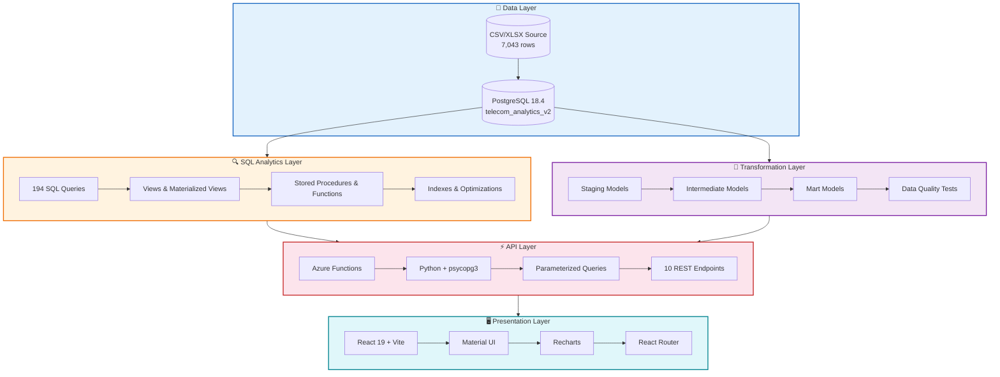
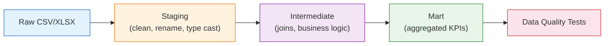
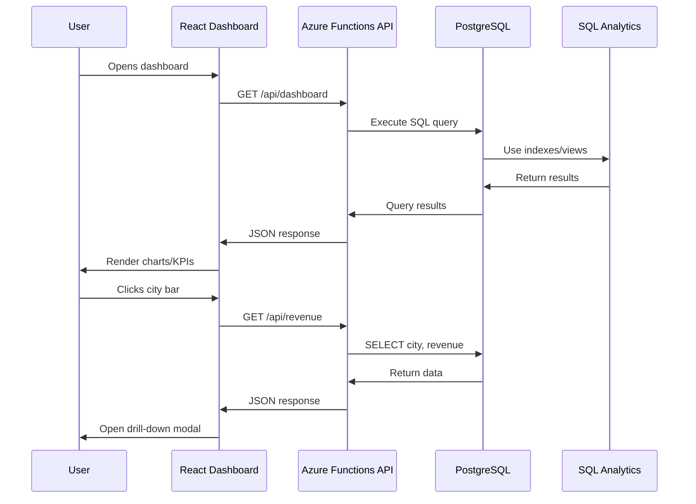

# Architecture Documentation

## System Overview

The Telecom Customer Churn Analytics Platform is a full-stack data analytics solution built on a modern cloud-native architecture. It processes 7,043 customer records through multiple layers to deliver interactive business intelligence dashboards.

## High-Level Architecture



## Layer Details

### 1. Data Layer

**PostgreSQL 18.4 Database** (`telecom_analytics_v2`)

| Property | Value |
|----------|-------|
| Engine | PostgreSQL 18.4 |
| Database | `telecom_analytics_v2` |
| Table | `telecom_churn` |
| Rows | 7,043 |
| Columns | 33 |
| Indexes | 13+ |
| Views | 10+ |

**Schema Design:**
- CHECK constraints on categorical columns (gender, churn_label, contract, etc.)
- Proper data types (NUMERIC for charges, INTEGER for counts)
- Composite and single-column indexes for query optimization
- Comments on all tables and columns

### 2. SQL Analytics Layer

194 SQL objects organized by complexity:

| Category | Count | Techniques |
|----------|-------|------------|
| Basic Aggregations | 30 | COUNT, SUM, AVG, GROUP BY, HAVING |
| Window Functions | 30 | ROW_NUMBER, RANK, LAG, LEAD, NTILE |
| Subqueries | 25 | Correlated, EXISTS, IN |
| CTEs | 25 | Basic, Recursive, Multi-level |
| Business Analytics | 25 | KPIs, Revenue, Segmentation |
| Views | 12 | Standard, Materialized |
| Optimization | 15 | Indexes, EXPLAIN ANALYZE |
| Procedures | 12 | Functions, Triggers |
| Advanced | 20 | Pivoting, String/Date |

### 3. Transformation Layer (dbt)



**dbt Project Structure:**
```
telecom_dbt/
├── models/
│   ├── staging/          # Raw data cleaning
│   ├── intermediate/     # Business logic
│   └── marts/            # Aggregated KPIs
├── macros/               # Reusable SQL
├── seeds/                # Static data
├── tests/                # Data quality
└── dbt_project.yml       # Configuration
```

### 4. API Layer

**Azure Functions REST API** (Python)

| Component | Technology |
|-----------|------------|
| Runtime | Azure Functions |
| Language | Python 3.x |
| Driver | psycopg3 |
| Architecture | Clean (routes, SQL, DB separated) |

**Endpoint Architecture:**
```
function_app.py (Routes)  →  queries.py (SQL)  →  db.py (Connection)
        │                          │                      │
        ▼                          ▼                      ▼
   HTTP Request            Parameterized SQL        Connection Pool
        │                          │                      │
        ▼                          ▼                      ▼
   JSON Response            Query Results          PostgreSQL DB
```

**10 REST Endpoints:**
| Endpoint | Method | Description |
|----------|--------|-------------|
| `/api/dashboard` | GET | Executive KPIs |
| `/api/customers` | GET | Paginated customer list |
| `/api/customer` | GET | Single customer detail |
| `/api/churn` | GET | Churn distribution |
| `/api/contracts` | GET | Contract breakdown |
| `/api/topcities` | GET | Top cities by count |
| `/api/revenue` | GET | Top cities by revenue |
| `/api/monthlycharges` | GET | Charge statistics |
| `/api/internet` | GET | Internet service breakdown |
| `/api/churnreasons` | GET | Top churn reasons |

### 5. Presentation Layer

**React Dashboard** (Vite + MUI + Recharts)

| Component | Technology |
|-----------|------------|
| Framework | React 19 |
| Bundler | Vite |
| UI Library | Material UI |
| Charts | Recharts |
| HTTP Client | Axios |
| Routing | React Router |

**6 Dashboard Pages:**
1. **Executive Dashboard** — KPIs + 5 charts + city drill-down
2. **Customers** — Search, sort, paginate, detail drawer
3. **Churn Analysis** — Reasons, contract, internet breakdown
4. **Revenue Analysis** — City revenue, leaderboard, stats
5. **SQL Explorer** — Query viewer with syntax highlighting
6. **About Project** — Architecture, tech stack, features

## Data Flow



## Security

| Measure | Implementation |
|---------|---------------|
| SQL Injection Prevention | Parameterized queries (`%s` placeholders) |
| Connection Security | Environment-based credentials |
| API Authentication | Azure Functions auth levels |
| Input Validation | Query parameter parsing |
| Error Handling | JSON error responses, logging |

## Performance

| Optimization | Details |
|-------------|---------|
| Database Indexes | 13+ indexes on frequently queried columns |
| Connection Management | Context managers with automatic cleanup |
| Query Optimization | EXPLAIN ANALYZE validated |
| Pagination | LIMIT/OFFSET for large datasets |
| Loading States | Skeleton components for perceived performance |

## Deployment

```
┌─────────────────────────────────────────────────────┐
│                   Production                        │
├─────────────────────────────────────────────────────┤
│  React Dashboard  →  Azure Static Web Apps         │
│  Azure Functions  →  Azure Functions App            │
│  PostgreSQL       →  Azure Database for PostgreSQL  │
└─────────────────────────────────────────────────────┘

┌─────────────────────────────────────────────────────┐
│                   Development                       │
├─────────────────────────────────────────────────────┤
│  React Dashboard  →  localhost:3000 (Vite)          │
│  Azure Functions  →  localhost:7071 (func start)    │
│  PostgreSQL       →  localhost:5432 (local install) │
└─────────────────────────────────────────────────────┘
```

## Technology Decisions

| Choice | Rationale |
|--------|-----------|
| PostgreSQL over MySQL | Advanced window functions, CTEs, PERCENTILE_CONT |
| Azure Functions over Flask | Serverless, auto-scaling, built-in monitoring |
| React over Angular | Larger ecosystem, faster development |
| Material UI over Bootstrap | Pre-built data components, theming |
| Recharts over D3 | Declarative API, React integration |
| psycopg3 over psycopg2 | Modern async support, better type handling |
| dbt for transformations | Version control, testing, documentation |
